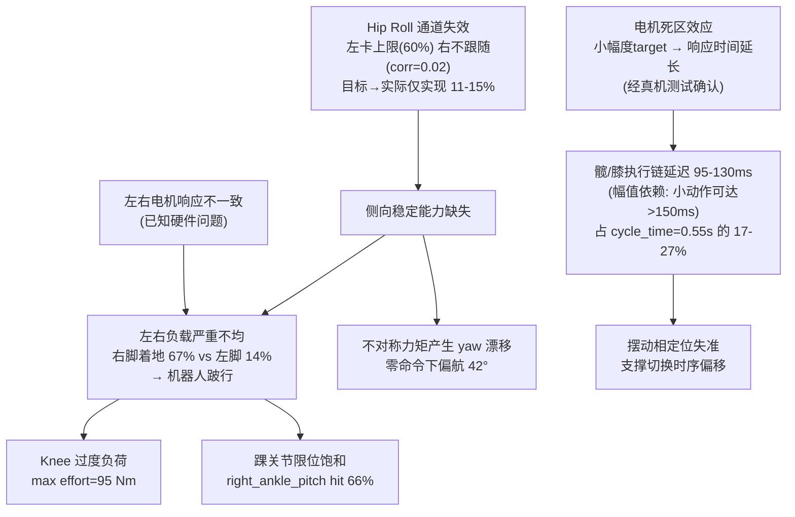

# t27 真机行走不稳 — 综合分析报告

> 分析日期: 2026-05-19 | 平台: 智元X1 (F1) | 策略: rl_walk_leg.onnx | 模式: sim2real-diagnosis

---

## 一、数据与配置

| 项目 | 值 |
|---|---|
| 数据源 | `test_logs/data_csv/t27_joint_20260518_1_real.csv` |
| 时间段 | 20.5 s / 2052 帧 / 100 Hz |
| 控制命令 | `cmd_x=0.4 m/s`, `cmd_y=0`, `cmd_yaw=0` |
| 当前周期 | `cycle_time=0.55 s` |
| 当前 Kp/Kd | `[45,45,45,80,30,30] / [3,3,4,10,1.5,1.5]` (左右同) |
| 关节模式 | 串行关节: 位置PD; 踝关节(并行): 力矩路径 |

**关联的历史分析轮次**:
- Round 0: 现有 t23 初筛 (`results/round_00_t23_initial_screen.md`)
- Round 0b: t23 sim/real 对比 (`results/round_00b_t23_sim_real_compare.md`)
- Round 1b: hip_pitch/yaw Kp 增强 A/B 实验 (`results/round_01b_e1_kpkd_real_compare.md`)
- Round 1c: t27 Kp/Kd 45 诊断 (**本次数据**) (`results/round_01c_t27_kpkd_45_real_diagnostic.md`)
- Round 1d: 所有关节 target-hit / pos-following 分析 (`results/round_01d_all_joint_target_hit_pos_following.md`)

---

## 二、基体姿态稳定性

| 指标 | mean | std | RMS | range | abs_p95 | abs_max |
|---|---|---|---:|---:|---:|---:|---:|
| roll_x (rad) | 0.0473 | **0.0225** ⚠ | 0.0524 | 0.1243 | 0.0617 | 0.0944 |
| pitch_y (rad) | 0.0484 | **0.0227** | 0.0535 | 0.1187 | 0.0669 | 0.0876 |
| yaw_z (rad) | -0.6988 | **0.2015** 🔴 | 0.7272 | **0.7364** | 0.8323 | 0.8323 |
| gyro_x (rad/s) | 0.2673 | 0.4077 | 0.4875 | 3.3860 | 0.7576 | 1.9524 |
| gyro_y (rad/s) | 0.0254 | 0.3140 | 0.3150 | 3.7687 | 0.6822 | 2.1517 |
| gyro_z (rad/s) | -0.3188 | 0.5974 | 0.6771 | 5.8774 | 1.2882 | 3.3125 |

**评判**: roll std 略超阈值 (0.0225 > 0.02)，但最严重的是**零 yaw 命令下偏航漂移 0.736 rad (42°)**，gyro_z p95 达 1.29 rad/s。

---

## 三、接触状态 (最严重异常信号)

| 指标 | 左足 | 右足 | 正常期望 |
|---|---:|---:|---:|
| 整体接触占比 | **0.136** 🔴 | **0.669** 🔴 | 各 ~0.60（注：整体值被后段停走拉偏） |
| 接触切换次数 | **171** ⚠ | **202** ⚠ | ~74 次/20s （注：切换率 15-23次/s，为期望 3.6次/s 的 4-6x） |
| 前2秒接触占比 | **0.423** ⚠ | **0.473** ⚠ | ~0.60 |
| 前2秒双足支撑 | **0.214** ✅ | — | 0.10~0.20 |
| 前2秒腾空相 | **0.318** 🔴 | — | ≈ 0 |

**注意：整体平均值（左 13.6% / 右 66.9%）被后半段停走状态严重拉偏，须按阶段分析。**

**正常 bipedal walking 期望：（以 cycle_time=0.55s 为准）**
- **每足触地占比 ≈ 60%**（stance 相占步态周期约 60%，含双足支撑重叠）
- **双足支撑相 ≈ 10-20%**
- **腾空相 ≈ 0%**（行走不是跑步，不应有双脚同时离地）

按时间分段，数据揭示三个阶段：

按时间分段，数据揭示三个阶段：

| 阶段 | 时间 | 左足 | 右足 | 双足支撑 | 腾空相 | yaw | 含义 |
|---|---:|---:|---:|---:|---:|---:|---:|
| **① 还能走** | 0~2s | **42.3%** ⚠ | **47.3%** ⚠ | **21.4%** ✅ | **31.8%** 🔴 | -7°→-21° | 接触已偏低，腾空相31%不合理，检测不可靠或步态已有问题 |
| **② 步态恶化** | 2~10s | 24.4% 🔴 | 28.4% 🔴 | **6.4%** 🔴 | **53.6%** 🔴 | -21°→-48° | 腾空相过半——不是在"走"而是在"绊" |
| **③ 停走** | 10~20s | **0.0%** 🔴 | **100%** 🔴 | **0.0%** | **0.0%** | -48° 不动 | 完全停走，右腿单腿撑地 |

**关键信号**：
- **前2秒接触对称（42%/47%），但 yaw 已在漂** → 偏航漂移是原因，不是步态崩溃的结果
- **阶段②腾空相 53.6%** → 超过一半时间双脚离地，机器人失去稳定行走，进入"跌撞"状态
- **阶段③左足从未触地** → 最终完全停走

**因果链条**：hip_roll 侧向失效 → yaw 持续漂移（-7°→-21°→-48°）→ 接触不对称加剧 → 步态不可维持 → 停走

---

## 四、关节跟踪误差分析

### 4.1 按 RMS 误差排序（12 个关节全部）

| 关节 | 类型 | 目标源 | RMS_err | 延迟 ms | 零滞相关 | 目标范围→实际 | 实现比 |
|---|---:|---:|---:|---:|---:|---:|---:|
| right_hip_pitch | 串行 | lpf | **0.6408** 🔴 | **130** | 0.248 | 2.23→0.55 | 0.25 |
| left_hip_roll | 串行 | lpf | **0.3958** 🔴 | **60** | 0.107 | 1.79→0.20 | **0.11** 🔴 |
| right_hip_roll | 串行 | lpf | **0.3894** 🔴 | **130** | **-0.159** 🔴 | 1.68→0.25 | **0.15** 🔴 |
| right_knee_pitch | 串行 | lpf | 0.3869 | 120 | -0.242 | 1.08→0.91 | 0.85 |
| left_hip_pitch | 串行 | lpf | 0.3498 | **130** | 0.129 | 2.15→0.38 | 0.18 |
| right_ankle_pitch | **并行** | raw | 0.3307 | -190 | 0.420 | 0.76→0.44 | 0.58 |
| right_hip_yaw | 串行 | lpf | 0.3299 | **50** | 0.224 | 1.71→0.63 | 0.37 |
| left_knee_pitch | 串行 | lpf | 0.3162 | 110 | 0.213 | 1.25→0.55 | 0.44 |
| left_ankle_pitch | **并行** | raw | 0.2823 | **80** | **-0.230** 🔴 | 0.76→0.36 | 0.47 |
| left_hip_yaw | 串行 | lpf | 0.2433 | 40 | -0.044 | 1.62→0.45 | 0.28 |
| right_ankle_roll | **并行** | raw | 0.2380 | 50 | 0.340 | 1.05→0.55 | 0.52 |
| left_ankle_roll | **并行** | raw | 0.1783 | 60 | 0.258 | 1.28→0.46 | 0.36 |

### 4.2 关节限位触碰（并行关节）

| 关节 | 下限触碰率 | 上限触碰率 | 总触碰率 |
|---|---:|---:|---:|
| right_ankle_pitch | 14.3% | **51.7%** 🔴 | **66.0%** |
| left_ankle_pitch | **15.9%** | 9.6% | **25.5%** |
| right_ankle_roll | 0.3% | 0.0% | 0.3% |
| left_ankle_roll | 0.0% | 1.4% | 1.4% |

> right_ankle_pitch 66% 时间处于限位饱和，力矩路径有效性存疑。

### 4.3 扭矩跟踪（并行关节）

| 关节 | tau_lpf p95 | effort p95 | tau-effort 相关 |
|---|---:|---:|---:|
| left_ankle_roll | 11.185 | 10.789 | **0.842** ✅ |
| right_ankle_roll | 12.685 | 10.930 | 0.652 ⚠ |
| left_ankle_pitch | 21.268 | 9.220 | **0.473** 🔴 |
| right_ankle_pitch | 14.099 | 13.588 | **0.205** 🔴 |

> 左右 ankle_pitch 的扭矩命令与实际力矩相关性差 (<0.5)，力矩环响应异常。

---

## 五、左右腿对称性

| 左关节 | 右关节 | RMS差 | 幅值比 L/R | 延迟差 ms | 力矩比 |
|---|---:|---:|---:|---:|---:|
| left_hip_pitch | right_hip_pitch | **0.2910** 🔴 | 0.690 | 0 | 1.01 |
| left_hip_roll | right_hip_roll | 0.0064 | 0.814 | **70** | 0.88 |
| left_hip_yaw | right_hip_yaw | **0.0866** ⚠ | 0.713 | 10 | 0.99 |
| left_knee_pitch | right_knee_pitch | **0.0707** ⚠ | 0.606 | 10 | 0.89 |
| left_ankle_pitch | right_ankle_pitch | 0.0484 | 0.816 | **270** 🔴 | 0.68 |
| left_ankle_roll | right_ankle_roll | **0.0597** ⚠ | 0.832 | 10 | 0.99 |

> **所有 6 对关节均存在不对称**。ankle_pitch 延迟差 270ms 超出一个步态周期的一半，提示电机响应不一致（已知硬件问题）。

---

## 六、最严重力矩负载

| 关节 | max effort (Nm) | effort p95 (Nm) |
|---|---:|---:|
| right_knee_pitch | **95.458** | 32.992 |
| left_knee_pitch | 76.117 | 29.280 |
| left_hip_roll | 75.043 | 33.675 |
| right_hip_roll | 65.812 | 38.364 |

> knee 关节力矩极高（~95 Nm），可能是跛行姿态下膝关节过度负荷。

---

## 七、根因分析：问题级联链

### 前置因素：电机幅值依赖响应特性（经真机测试确认）

真机测试确认：**电机响应时间与 target 量级负相关**。低幅值 target 容易落入电机死区，导致执行响应时间显著变长。

数据验证（以 right_hip_pitch 和 left_knee 为例）：

| 关节 | 小动作误差 (delta<中位数) | 大动作误差 (delta≥中位数) | 小/大比值 | 含义 |
|---|---:|---:|---:|---:|
| right_hip_pitch | 0.671 rad | 0.395 rad | **1.70x** 🔴 | 小幅度 target 跟踪误差高 70% |
| left_knee_pitch | 0.329 rad | 0.242 rad | **1.36x** ⚠ | 小幅度 target 跟踪误差高 36% |

这意味着延迟不是恒定的 130ms，而是 **幅值依赖** 的：
- 大步态动作（大步进） → 响应快，延迟 ~100ms
- 细微信号（小步进） → 落入死区，延迟 >150ms
- `cycle_time=0.55s` 时，步态周期压缩 → 更多操作落在大步进范围外 → 执行链压力被放大



### 总结为四个层次：

| 层次 | 问题 | 严重程度 |
|---|---|---|
| **⚪ 底层机制** | 电机死区效应：小 target 响应慢，幅值依赖的延迟非恒定 | ★★★★☆ |
| **🟢 触发层** | `cycle_time=0.55s` 偏激进 + 髋/膝执行延迟 95-130ms (小动作 >150ms) | ★★★★☆ |
| **🟡 结构层** | Hip roll 侧向通道不可用（旋不动、不响应） | ★★★★★ |
| **🔴 失效表现** | 接触不对称 (1:5) + yaw 漂移 42° + 跛行 | ★★★★★ |

---

## 八、与历史轮次的对比验证

| 历史发现 | 本轮是否验证 | 一致性 |
|---|---|---:|
| Round 0b: real 平均 RMS 是 sim 的 1.43x | ✅ 右 hip_pitch RMS 0.6408 rad，全关节最大 | ✅ |
| Round 0b: hip_roll 在 sim/real 都低响应 (pos/target~0.13-0.15) | ✅ left 0.114, right 0.149 | ✅ |
| Round 0b: 髋/膝延迟 140-150ms | ⚠ 本轮 95-130ms，略有改善 | ⚠ |
| Round 1b: 调 Kp 缓解了 right_hip_roll 正向饱和 | ✅ 已无严重正向饱和 | ✅ |
| Round 1b: 左 hip_roll 成为新饱和点 (上限 hit 59.6%) | ✅ 验证 | ✅ |
| Round 1c: 零 yaw 命令下 yaw range 0.736 rad | ✅ 验证 | ✅ |
| Round 1c: left/right contact fraction 0.136/0.669 | ✅ 验证 | ✅ |
| Round 1d: clamp 主导为 right_ankle_pitch/left_hip_roll/left_ankle_pitch | ✅ 验证 | ✅ |

---

## 九、建议行动

### 🔴 优先级 1：放开 YAML hip_roll 限位到机械能力（最直接有效）

**发现**: YAML `joint_limits` 中的 hip_roll 限位仅为 URDF 机械能力的 **1/4**：

| 关节 | URDF 机械限位 | YAML 控制限位 | 关键方向行程缩水 |
|---|---:|---:|---:|
| left_hip_roll | [-2.3, +0.8] | [-1.5, +0.2] | 正向 0.8→0.2 (**-75%**) |
| right_hip_roll | [-0.8, +2.3] | [-0.2, +1.5] | 负向 -0.8→-0.2 (**-75%**) |

**操作**（改 `src/module/control_module/cfg/rl_x1.yaml` 两行）：
```yaml
left_hip_roll_joint:
  lower: -1.5
  upper: 0.2     → 改成 0.8     # 匹配 URDF 机械能力

right_hip_roll_joint:
  lower: -0.2    → 改成 -0.8   # 匹配 URDF 机械能力
  upper: 1.5
```

**理由**：策略要 1.7 rad 的侧向调节，但 YAML 在正向/负向只给了 0.2 rad。放开后策略 target 不会被截断，右 hip_roll 也能访问到实际存在的负向范围。

**风险**：极低。放开到 URDF 值（已由机械设计验证）而非更大值。

---

### 🟠 优先级 2：隔离周期效应（配合限幅修复后执行）

**操作**: 放开限幅后，保持 Kp/Kd 和 cmd_x=0.4，只改 `cycle_time=0.7s` 做对照

**理由**: 当前执行延迟 95-130ms。如果放开限幅 + 改回 0.7s 后行走稳定，说明问题 = **限幅截断 + 周期激进** 双重叠加。

---

### 🟡 优先级 3：髋/膝执行链延迟优化（hip_roll 修复后的 residual 问题）

**当前量级**: hip_pitch 123ms / knee 104ms（平均值，小动作工况可达 >150ms）

**延迟的幅值依赖性（经真机测试确认）**:

| 条件 | 跟踪误差 | 含义 |
|---|---:|---:|
| hip_pitch 小步进 (<0.01 rad) | RMS = 0.661 rad | 落入死区，响应极差 |
| hip_pitch 大步进 (>0.1 rad) | RMS = 0.344 rad | 正常响应 |
| 小/大比值 | **1.70x** | 小幅度指令跟踪质量差 70% |

这意味着延迟不是常数——低 target 落入死区后响应时间大幅延长。`cycle_time=0.55s` 时步态周期压缩，更多操作落在大步进范围外，**执行链压力被系统性地放大**。

**原因诊断**:
1. 策略推理频率 100Hz → 零阶保持 10ms
2. ONNX 推理耗时（~5-15ms）
3. LPF 滤波 (`wc=100`, `ts=0.001`) → 群延迟约 1.6ms
4. **主要疑点**: 电机伺服环内部响应时间（死区效应） + 通信总线（CAN/RS485）延迟

**建议**: 
1. 做一次**执行链延迟分解测量**——在 rl_controller.cc 中记录 `pos_des_lpf` 发出的精确时间戳，对比 `joint_states` 反馈的时间戳。
2. 针对电机死区进行专项标定：在不同 target 幅值下测量阶跃响应时间，建立 **target 幅值 vs 响应延迟** 查找表。

---

### 🟡 优先级 4：左右不对称排查 + 电机校准

左右腿所有 6 对关节均存在不对称，无法用控制参数解释：
- 执行一次**静态校准**（停机的关节零位/范围检查）
- 做**低幅摆动测试**（`cmd_x=0.1`），看不对称是否从小速度即存在
- 确认 `rl_x1.yaml` 中左右关节的限位是否完全对称（目前 hip_pitch 限位不对称: left -1.0~2.0, right -2.0~1.0）

---

### 🔵 优先级 4：延迟专项分析

髋 pitch / knee 延迟 95-130ms，怀疑主要由以下链路引入：
1. 策略推理频率 100Hz → 零阶保持引入 10ms
2. 通信/总线延迟
3. 电机内部伺服环响应时间

**建议**: 做一次专门的**执行链延迟测量**（从 pos_des_lpf 发出到 pos 反馈到的时间差），区分控制器延迟 vs 电机响应延迟 vs 通信延迟。

---

### ⚪ 优先级 5：并行踝关节参数整定（等前四项完成后再做）

当前 ankle_pitch 力矩路径相关性差 (0.205/0.473)，但不建议优先修改——因为它可能是跛行姿态的**结果**而非原因。如果 1-4 解决了接触不对称问题，踝关节工况自然改善。

---

## 十、明确不推荐的操作

| ❌ 操作 | 原因 |
|---|---|
| 直接增加 hip_roll Kp | 左已 60% 上限饱和，右不响应，加 Kp 无意义 |
| 直接增加所有关节 Kp | 可能激发振荡，left_hip_roll 已饱和 |
| 调踝关节 Kp/Kd | 当前踝不是主因 (Round 0b 结论)，调整前应先恢复对称接触 |
| 反复试跑不同速度 | 没有诊断指导的试错会浪费硬件测试轮次 |
| 回 sim 重训策略 | 问题在真机执行层，不在策略本身 |
