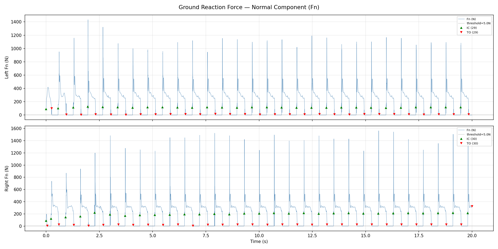
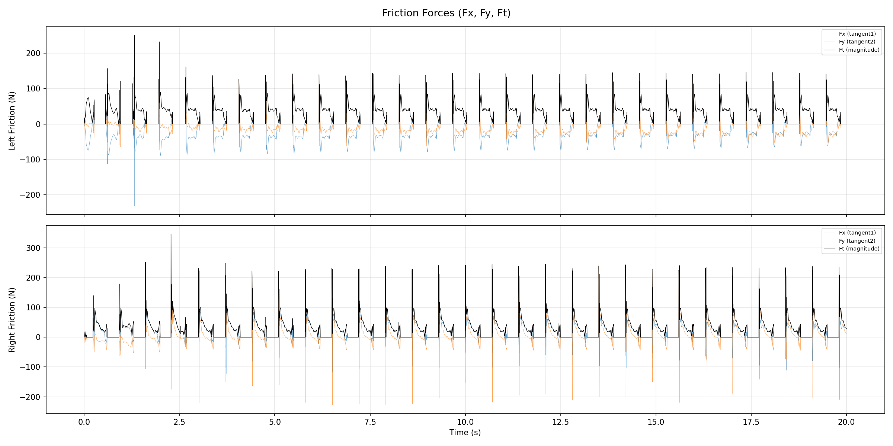
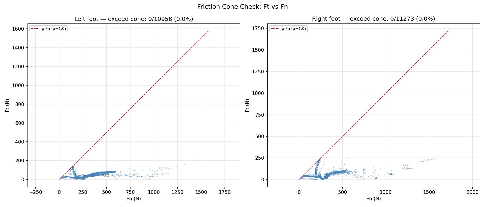
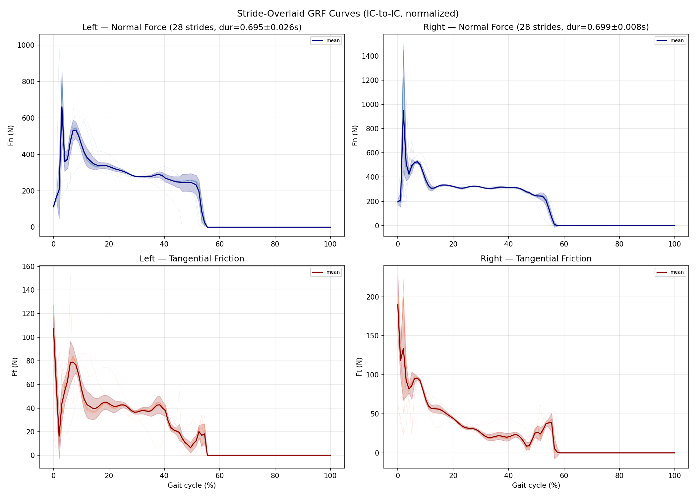
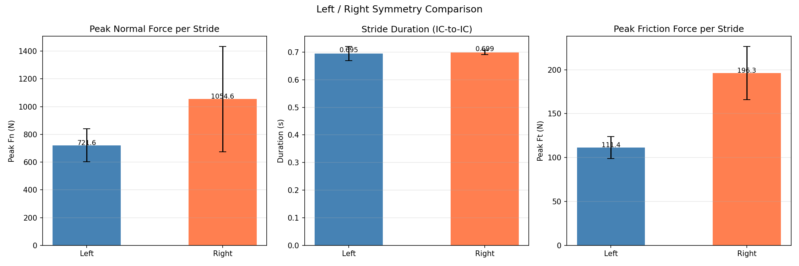
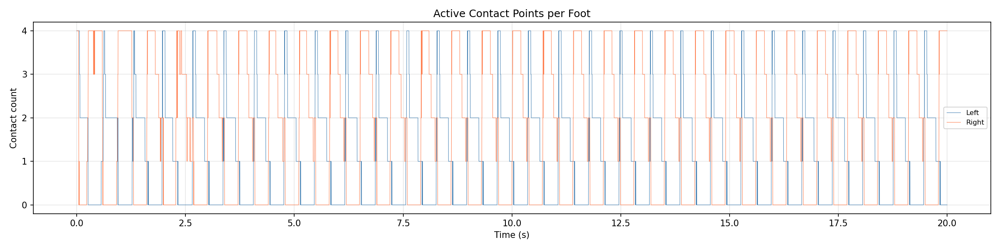

# GRF（地面反作用力）仿真分析报告

> **数据来源**: `grf_20260427_163437.csv`
> **采集时长**: 20.0 s（20000 帧 @ 1000 Hz）
> **触发条件**: 进入 `walk_leg` 模式后自动记录
> **仿真环境**: MuJoCo，平地（`flat.xml`，μ = 1.0，`condim = 3`）

---

## 1. 数据采集方法

在 `SimModule::CmdCallback` 中，每次 `mj_step()` 完成后调用 `LogGRFData()`：

1. 遍历 `d->contact` 数组中的所有活跃接触点
2. 筛选 **脚部碰撞体（ankle_roll body 下的 collision sphere）** 与 **地面（"floor" geom）** 之间的接触
3. 对每个匹配的接触调用 `mj_contactForce(m, d, contact_id, result)` 提取接触坐标系下的 6D 力
   - `result[0]` → **法向力 Fn**（垂直于接触面）
   - `result[1]`, `result[2]` → **切向摩擦力 Fx, Fy**（两个正交摩擦方向）
4. 对同一只脚的多个接触点（最多 4 个 collision sphere）进行力的累加、位置取均值
5. 计算切向合力 `Ft = √(Fx² + Fy²)`
6. 按帧写入 CSV

---

## 2. 分析结果总览

### 2.1 统计摘要

| 指标 | 左脚 | 右脚 |
|:--|:--|:--|
| IC（着地）事件数 | **29** | **30** |
| TO（离地）事件数 | **29** | **30** |
| 支撑相占比 | 54.8% | 56.4% |
| Fn 最大值 | 1432.5 N | 1563.1 N |
| Fn 支撑相均值 | 312.7 N | 323.9 N |
| Ft 最大值 | 250.4 N | 345.7 N |
| Ft 支撑相均值 | 39.7 N | 44.0 N |
| 步态周期 | 0.695 ± 0.026 s (n=28) | 0.699 ± 0.008 s (n=28) |
| 单步 Fn 峰值 | 721.6 ± 119.6 N | 1054.6 ± 379.6 N |
| 单步 Ft 峰值 | 111.4 ± 12.7 N | 196.3 ± 30.4 N |
| 摩擦利用率 (Ft/Fn) | 0.159 ± 0.033 | 0.214 ± 0.092 |

> **IC/TO 检测**：Fn > 5.0 N 阈值 + 鲁棒滤波（合并 < 50ms 的弹跳间隔，过滤 < 50ms 的噪声接触）。

---

## 3. 图表说明

### 3.1 法向力时序图（`01_grf_normal_force.png`）

- **上图**：左脚法向力 Fn 随时间变化；**下图**：右脚
- **绿色三角 ▲**：IC（Initial Contact，着地时刻）
- **红色倒三角 ▼**：TO（Toe-Off，离地时刻）
- **灰色虚线**：Fn = 5 N 接触判定阈值

**观察要点**：
- 着地瞬间出现明显的冲击尖峰（左脚最高 ~1400 N，右脚 ~1560 N），随后力值快速回落至支撑相稳态水平（~200–400 N）
- 采用鲁棒检测后，左右脚 IC/TO 事件数量一致（29 vs 30），完美交替

---

### 3.2 摩擦力时序图（`02_friction_force.png`）

- **蓝色/橙色线**：切向摩擦力两个分量 Fx（tangent1）、Fy（tangent2）
- **黑色线**：切向合力 Ft = √(Fx² + Fy²)

**观察要点**：
- 摩擦力在着地冲击时同样出现尖峰，与 Fn 尖峰同步
- 支撑相中期摩擦力相对平稳，量级约为法向力的 10–20%
- Fy 分量（前后方向）通常大于 Fx 分量（左右方向），符合行走主要是前后运动的预期

---

### 3.3 摩擦锥散点图（`03_friction_cone.png`）

- **横轴**：法向力 Fn；**纵轴**：切向合力 Ft
- **红色虚线**：摩擦锥边界 Ft = μ · Fn（μ = 1.0）
- 仅绘制 Fn > 5 N 的帧（有效接触帧）

**结论**：
- 左脚 **0/10958 (0.0%)** 超出摩擦锥
- 右脚 **0/11273 (0.0%)** 超出摩擦锥
- **无滑动风险**：所有接触力均在摩擦锥约束内，仿真中不存在足底打滑现象

---

### 3.4 步态周期叠加曲线（`04_stride_overlay.png`）

- 以 IC-to-IC 切分步态周期，归一化至 0–100% 步态相位
- **浅色细线**：各步的单独曲线
- **深色粗线**：均值曲线
- **阴影区域**：±1 std 置信带
- **上排**：法向力 Fn；**下排**：切向摩擦力 Ft

**观察要点**：
- 左脚 28 步，周期 0.695 ± 0.026 s，步间一致性好（std 带窄）
- 右脚 28 步，周期 0.699 ± 0.008 s，步间一致性极佳
- 左右脚 GRF 曲线形态相似：着地冲击尖峰→支撑相稳态→离地卸载
- 右脚峰值偏高（Fn 1054.6 vs 721.6 N），可能与着地速度差异有关

---

### 3.5 左右对称性统计（`05_symmetry.png`）

三组柱状图对比左右脚：
- **Peak Fn**：单步法向力峰值（左 721.6 N vs 右 1054.6 N）
- **Stride Duration**：步态周期时长（左 0.695 s vs 右 0.699 s，基本一致）
- **Peak Ft**：单步摩擦力峰值（左 111.4 N vs 右 196.3 N）

**结论**：
- **步数和步态周期左右对称**（29 vs 30 步，周期 ~0.70 s）
- 右脚着地冲击力偏大（峰值高约 46%），摩擦力同样偏高，但步频完全一致

---

### 3.6 接触点数时序（`06_contact_count.png`）

- **蓝色**：左脚活跃接触点数（0–4）
- **橙色**：右脚活跃接触点数（0–4）

**观察要点**：
- 支撑相通常 4 个 collision sphere 全部接触（全掌着地）
- 着地/离地过渡期会出现 1–3 个接触点的中间状态
- 接触数为 0 的区间对应摆动相

---

## 4. 关键发现与建议

| # | 发现 | 影响 | 建议 |
|:--|:--|:--|:--|
| 1 | **左右步数/周期对称**（29 vs 30 步，~0.70s） | 步态节奏正常 | 无需调整 |
| 2 | **着地冲击力大**（峰值 >1400 N，右脚偏高 46%） | 真机关节寿命缩短，传感器冲击噪声 | 考虑增加着地缓冲或调低着地速度；排查右脚着地速度偏大原因 |
| 3 | **摩擦利用率低**（~0.16–0.21，远低于 μ=1.0） | 安全余量充足，无打滑风险 | 当前摩擦系数设置下无需调整 |
| 4 | **左脚着地存在短时弹跳**（原始检测 56 IC，滤波后 29） | 着地不够平稳 | 检查左脚着地轨迹规划的平滑性 |

---

## 5. 机器人结构不对称性分析

### 5.1 已知机械不对称参数

| 参数 | 左腿 | 右腿 | 差值 |
|:--|:--|:--|:--|
| 大腿段长（knee_pitch_joint xyz.z） | 142.2 mm | 148.0 mm | **右腿长 +5.8 mm（+4%）** |
| hip_yaw 关节距骨盆中心（y 方向） | 83.8 mm | 77.8 mm | **右腿内扣 −6.0 mm** |

### 5.2 物理含义

- **右腿大腿段比左腿长 5.8 mm**：自然站立时右脚踩地位置更低，骨盆产生右倾趋势；摆动相右腿需要更大的抬腿幅度才能完成与左腿等效的步高。
- **右腿髋关节比左腿靠内 6.0 mm**：右腿整体更"内扣"，站立时支撑基底偏右，重心天然偏向右侧，右脚承重更大。

### 5.3 与 GRF 数据的关联

| GRF 观测结果 | 可能的结构性原因 |
|:--|:--|
| 右脚单步 Fn 峰值偏高（1054.6 N vs 左 721.6 N，**+46%**） | 右腿大腿长 → 着地时质心下降幅度更大 → 冲击力更大；髋关节内扣 → 重心偏右 → 右脚负重更多 |
| 右脚单步 Ft 峰值偏高（196.3 N vs 左 111.4 N，**+76%**） | 右脚更大法向力导致摩擦需求同步增大（Ft ∝ Fn） |
| 右脚摩擦利用率略高（0.214 vs 左 0.159） | 右脚在支撑末期需要更大切向力来推进重心，与腿长差异引起的步态补偿一致 |
| 左脚着地弹跳更明显（原始 56 IC → 鲁棒 29 IC） | 左腿大腿较短，着地速度较低，但因骨盆右倾导致左脚落地角度不稳定，产生二次接触 |
| 步态周期左右一致（0.695 vs 0.699 s） | RL 控制器已通过调整步频补偿腿长差异，维持了正常的时序对称性 |

### 5.4 建议

1. **MJCF 模型检查**：确认 `left_knee_pitch_joint` 和 `right_knee_pitch_joint` 的 xyz.z 参数是真实硬件测量值还是建模误差，如为误差应修正至一致。
2. **髋关节偏置补偿**：在控制层对髋宽不对称（6 mm）添加静态重心偏置补偿，减少右脚过载。
3. **sim2real 注意事项**：若真实机器人存在同等腿长差异，仿真数据（右脚峰值 GRF 约 46% 偏高）可作为真机预期的基线参考。

---

## 6. 文件清单

| 文件 | 说明 |
|:--|:--|
| `01_grf_normal_force.png` | 左右脚法向力时序 + IC/TO 事件标注 |
| `02_friction_force.png` | 摩擦力分量 Fx/Fy 及合力 Ft 时序 |
| `03_friction_cone.png` | 摩擦锥约束检查散点图（Ft vs Fn） |
| `04_stride_overlay.png` | IC-to-IC 步态周期叠加曲线（均值 ± std） |
| `05_symmetry.png` | 左右脚对称性统计柱状图 |
| `06_contact_count.png` | 左右脚活跃接触点数时序 |
| `summary.txt` | 统计摘要（纯文本） |
| `report.md` | 本分析报告 |
